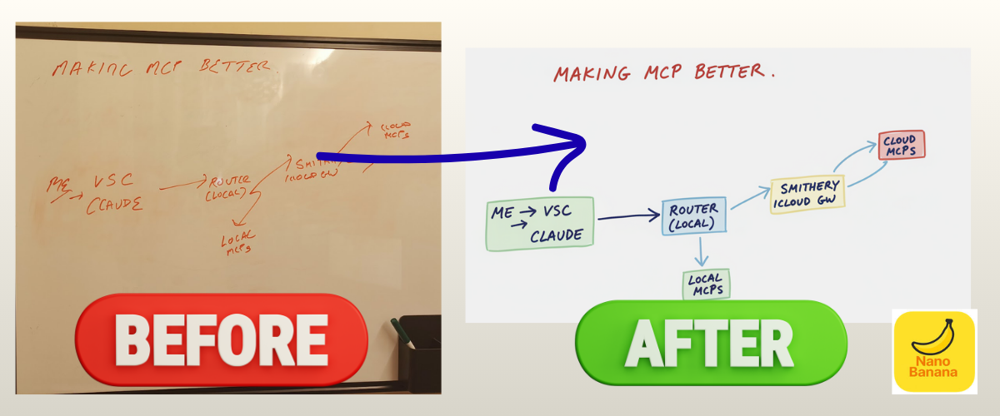
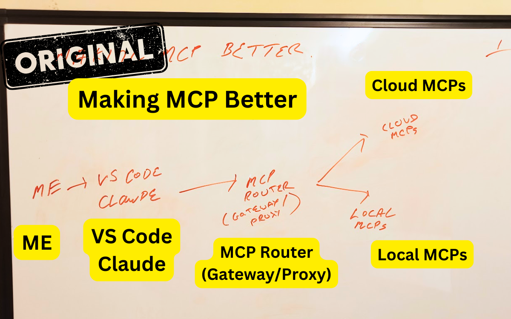
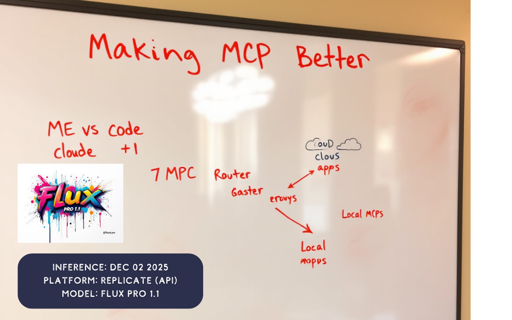
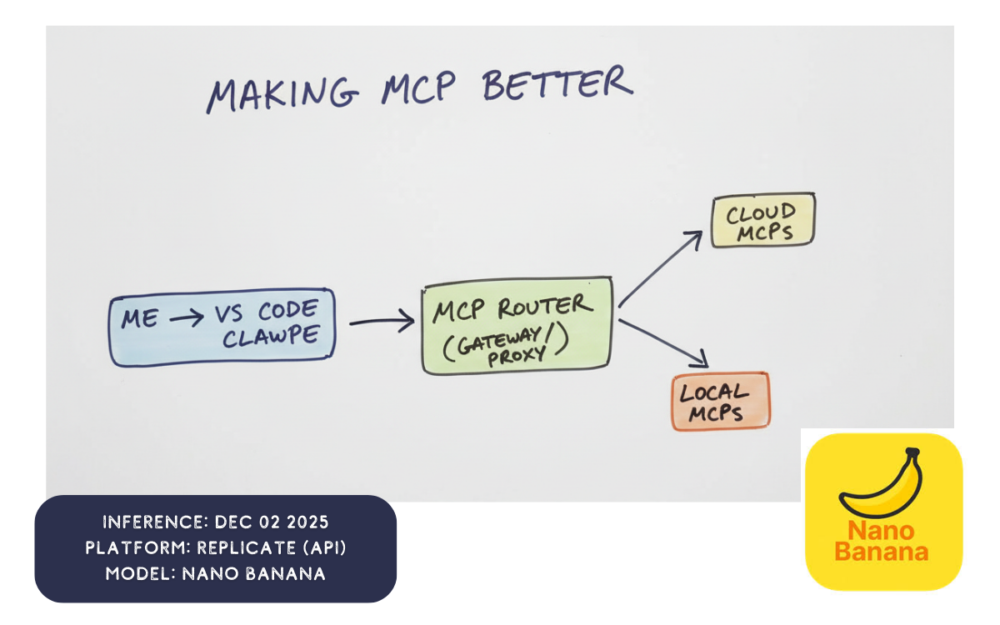
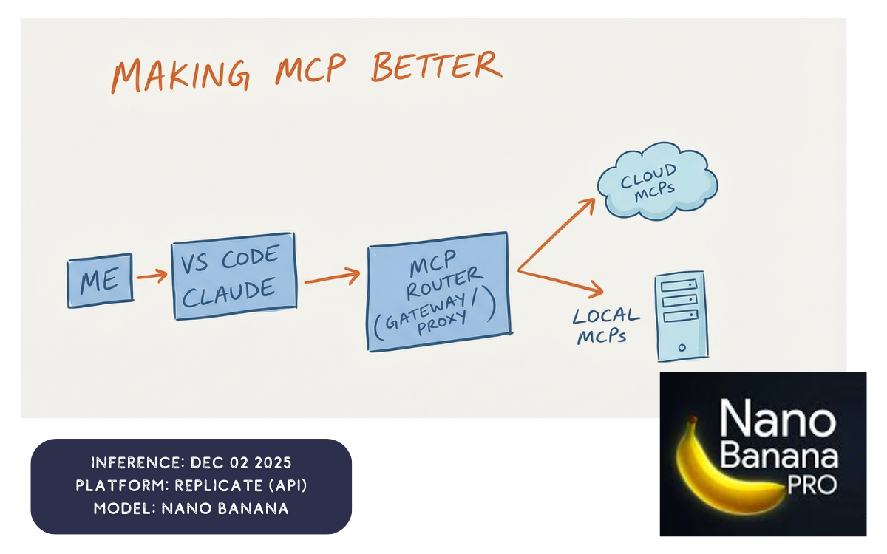
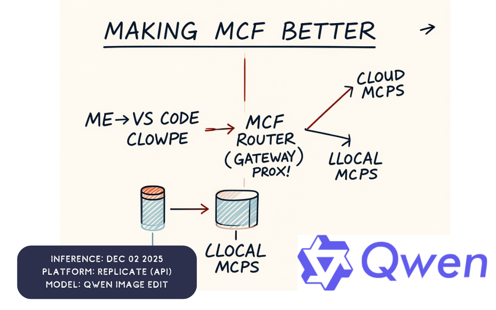
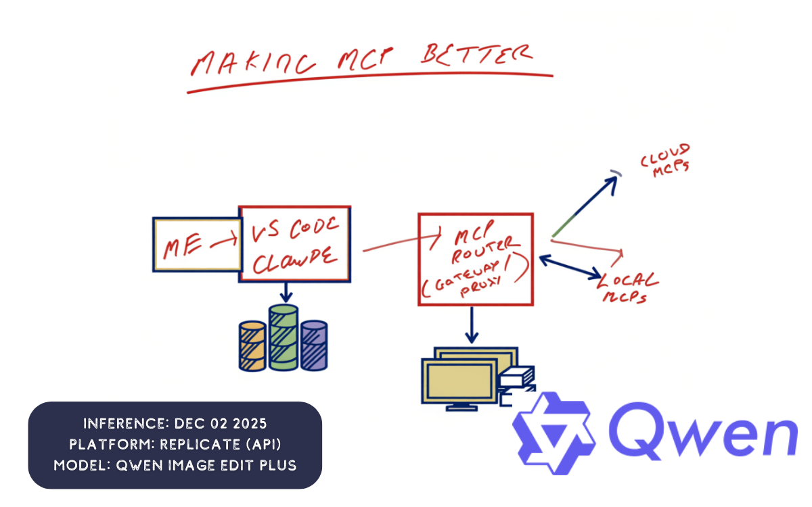

# AI, Fix My Messy Whiteboard!

[](https://github.com/danielrosehill/AI-Fix-My-Messy-Whiteboard)

A local AI utility for cleaning up whiteboard photographs using image-to-image processing models via Replicate.



## Overview

Whiteboard Processor transforms messy whiteboard photos into clean, professional diagrams. It uses various image generation models through Replicate's API to redraw whiteboard content with:

- Clean white backgrounds (no glare or reflections)
- Legible, clear text
- Professional lines, arrows, and shapes
- Preserved layout and spatial relationships

## Features

- **CLI-based workflow** - Drop images into a queue folder and process them interactively
- **Multiple model support** - Switch between different image models (FLUX, Qwen, Google Nano-Banana)
- **Evaluation framework** - Compare model outputs side-by-side to find the best results
- **Batch processing** - Process multiple whiteboard images in one run

## Installation

```bash
cd app
python -m venv .venv
source .venv/bin/activate
pip install -r requirements.txt
```

Create a `.env` file in the project root with your Replicate API key:

```
REPLICATE_API_KEY=your_key_here
```

## Usage

```bash
# Run the processor
./run.sh

# Or directly with Python
cd app && python process_whiteboard.py

# Specify a model
python process_whiteboard.py -m nano-banana-pro

# List available models
python process_whiteboard.py --list-models
```

Place whiteboard images in `images/originals/queue/<folder-name>/` and run the processor. Enhanced outputs are saved to `images/enhanced/`.

## Models

The tool currently includes configurations for:

- `nano-banana` - Google Gemini 2.5 Flash (default, fast)
- `nano-banana-pro` - Google Gemini 3 Pro (highest quality)
- `flux-kontext-pro` - FLUX Kontext Pro
- `flux-1.1-pro` - FLUX 1.1 Pro
- `qwen-image-edit` - Qwen Image Edit
- `qwen-image-edit-plus` - Qwen Image Edit Plus

**Note:** Image generation models evolve rapidly. The current model selection will likely become outdated. Swap in newer/better models as they become available on Replicate by editing the `MODELS` dict in `app/process_whiteboard.py`.

## Evaluation

An evaluation script is included to compare model outputs:

```bash
cd eval
python run_eval.py
```

Place test images in `eval/source/` and the script will run them through all configured models, saving results to timestamped folders in `eval/runs/`.

---

## Replicate Comparison (Dec 02, 2025)

Original whiteboard with text annotations:



### Flux Pro 1.1



### Flux 1.1 Kontext


 
### Nano Banana



### Nano Banana Pro



### Qwen Image Edit



### Qwen Image Edit Plus
 


---

## License

MIT
